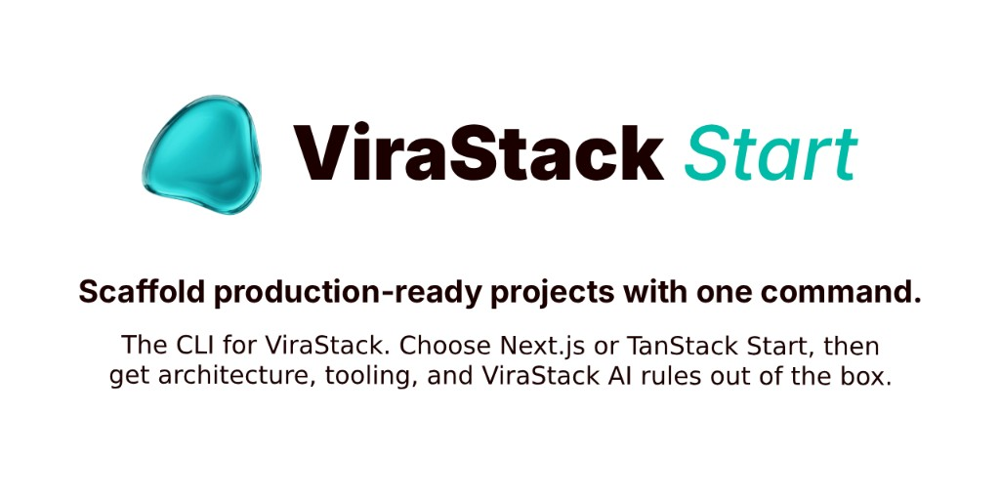

<p align="center">
  
</p>

<h1 align="center">ViraStack Start</h1>

<p align="center"><strong>One command. Production-ready stack.</strong></p>

<p align="center">
  Scaffold new projects and add tools from the <a href="https://virastack.com">ViraStack</a> ecosystem.
</p>

<p align="center">
  <a href="https://virastack.com"></a>
  <a href="https://www.npmjs.com/package/virastack"></a>
  <a href="https://www.npmjs.com/package/virastack"></a>
  <a href="package.json"></a>
  <a href="LICENSE"></a>
  <a href="https://x.com/virastack"></a>
</p>

---

## Who is this for?

- Teams that want a consistent Next.js (and soon TanStack Start) foundation
- Developers who want AI rules, architecture, and tooling ready on day one
- Anyone bootstrapping a new product without reinventing the stack

## Prerequisites

- Node.js `>=18.17`

## Quick Start

```bash
npx virastack
```

Turkish prompts:

```bash
npx virastack --tr
```

Add a ViraStack tool to an existing project:

```bash
npx virastack add mask
npx virastack add password
```

## What it asks

1. **Project name** — a folder name, or `.` for the current directory.
2. **Template** — Next.js App Router (TanStack Start coming soon).
3. **Multi-language (i18n)** — Choose whether you need built-in internationalization support.
4. **ViraStack tools** — optional `@virastack/mask`, `@virastack/password`.

Scaffolded Next.js projects include a pre-configured [**ViraStack AI**](https://github.com/virastack/ai) layer (architecture & rules), alongside specialized design skills from [**Emil Kowalski**](https://github.com/emilkowalski/skills) and [**Jakub Krehel**](https://github.com/jakubkrehel/make-interfaces-feel-better).

## Tools

| Tool | Description |
| :--- | :--- |
| `@virastack/ai` | Pre-configured AI layer and coding rules for modern AI assistants (included in templates by default) |
| `@virastack/mask` | Input masking and formatting (Phone, IBAN, etc.) |
| `@virastack/password` | Password visibility toggle with customizable icons and text |

## Options

| Flag | Description |
| :--- | :--- |
| `--tr` | Turkish prompts |
| `--telemetry-disable` | Permanently disable anonymous usage tracking |
| `-v`, `--version` | Print CLI version |
| `-h`, `--help` | Show usage |

## Telemetry

To understand which tools and templates are preferred by the community, ViraStack collects strictly anonymous usage data (template, i18n choice, selected tools, package manager, and CLI version). Absolutely no personal data, project names, or file paths are collected.

Opt out anytime: `npx virastack --telemetry-disable`

## Contributing

Ideas and bug reports are welcome — open an [issue](https://github.com/virastack/start/issues).

## Explore the ViraStack Ecosystem

Discover all tools and libraries at [**virastack.com**](https://virastack.com).

## License

Licensed under the [MIT License](LICENSE).

## Maintainer

A project by [**Ömer Gülçiçek**](https://omergulcicek.com)

[](https://github.com/omergulcicek)
