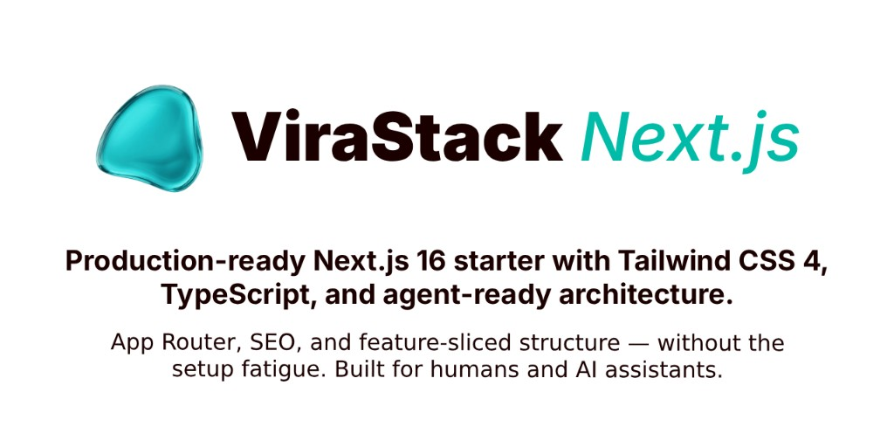

# ViraStack - Next.js Boilerplate

**The Next.js boilerplate that feels effortless.**

Next.js 16 · React 19 · Tailwind CSS 4 · Base UI · TypeScript strict · Agent-ready

[](https://virastack.com)
[](https://www.npmjs.com/package/virastack)
[](https://www.npmjs.com/package/virastack)
[](package.json)
[](LICENSE)
[](.github/workflows/ci.yml)
[](https://x.com/virastack)

---

**Contents:** [Features](#features) · [Getting started](#getting-started) · [Scripts](#scripts) · [Project structure](#project-structure) · [ViraStack AI](#virastack-ai) · [Deployment](#deployment)

Production-grade Next.js starter with feature-sliced architecture, strict TypeScript, and a pre-configured [**ViraStack AI**](https://github.com/virastack/ai) layer — so you and your coding agents ship consistent code from day one.

## Features

- ⚡ **Next.js 16** — App Router, Turbopack, React Compiler
- ⚛️ **React 19** + TypeScript strict (`noUncheckedIndexedAccess`)
- 🎨 **Tailwind CSS 4** + Base UI primitives (shadcn-style, fully yours to own)
- 🔄 **TanStack Query** · **Zustand** · **nuqs** — server, client, and URL state, each with a dedicated tool
- 📋 **React Hook Form** + **Zod** — validated forms end to end
- 🤖 **ViraStack AI** — `AGENTS.md`, `.cursor/rules`, `llms.txt`, and design skills
- ✅ **Quality built in** — ESLint, Prettier, Knip, Husky, Commitlint, GitHub Actions CI

## Getting started

**Prerequisites:** Node.js `>=20.9`

If you created this project with [`npx virastack`](https://github.com/virastack/start), dependencies are already installed. Otherwise:

```bash
pnpm install   # or npm / yarn / bun
cp .env.example .env.local
pnpm dev
```

Open [http://localhost:3000](http://localhost:3000). The landing page demos the stack: theme toggle, TanStack Query user list, Zustand cart, Zod-validated project form, and `nuqs` search state in `UsersDemo`.

## Scripts

| Script | Description |
| :--- | :--- |
| `dev` | Start the dev server (Turbopack) |
| `build` | Production build |
| `start` | Serve the production build |
| `analyze` | Build with bundle analyzer |
| `lint` / `lint:fix` / `lint:ci` | ESLint (+ format check in CI) |
| `format` / `format:check` | Prettier |
| `typecheck` | `tsc --noEmit` |
| `knip` | Find unused files, exports, and dependencies |

## Project structure

```
src/
├── app/                  # Routes, layouts, metadata (App Router only)
├── features/
│   └── [feature]/
│       ├── api/
│       ├── components/
│       ├── constants/
│       ├── data/
│       ├── helpers/
│       ├── hooks/
│       ├── schemas/
│       ├── stores/
│       ├── types/
│       └── index.ts
├── components/
│   ├── ui/               # Base UI primitives (Button, Dialog, Tabs, …)
│   ├── layout/           # Header, Footer
│   └── shared/           # Cross-feature components (ThemeToggle, …)
├── hooks/
├── stores/
├── schemas/
├── providers/
├── lib/                  # api.ts, query-client.ts, utils
├── config/
├── constants/
├── data/
├── helpers/
├── types/
├── styles/
└── env.ts
```

The bundled `landing` feature is a flat demo (`Hero`, `Playground` with showcase sections). New features should follow the full tree above. See [`docs/architecture-guide.md`](docs/architecture-guide.md) for placement rules and import conventions.

## ViraStack AI

Developed with [**ViraStack AI**](https://github.com/virastack/ai) — an AI-native architecture kit that ships agent context into every project:

| File | Purpose |
| :--- | :--- |
| `AGENTS.md` | Agent operating guide |
| `CLAUDE.md` | Claude Code entry point |
| `.cursor/rules/` | Scoped coding rules |
| `public/llms.txt` | Machine-readable project summary |
| `.agents/skills/` | Design-taste skills |

Install or refresh rules: `npx @virastack/ai init`

## Deployment

Optimized for [Vercel](https://vercel.com/). Set variables from `.env.example` in your hosting provider. Run `analyze` before shipping to keep bundle size in check.

## Contributing

Ideas and bug reports welcome — open an [issue](https://github.com/virastack/start/issues).

---

<div align="center">

Bootstrapped with [**ViraStack Start**](https://github.com/virastack/start) · Built by <a href="https://omergulcicek.com">Ömer Gülçiçek</a> · <a href="LICENSE">MIT Licensed</a>

</div>
